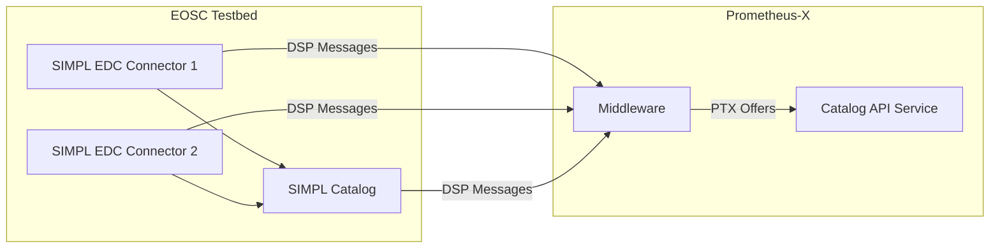

# Dataspace Interoperability

The goal of Dataspace Interoperability is to enable interactions between different dataspaces, allowing them to share data, services, and functionality. This document focuses on the first milestone of this effort, which is to interface with SIMPL and their open source work.

## Introduction

EOSC is deploying a SIMPL agent to interface with other dataspaces. As part of the Prometheus-X dataspace, we aim to explore this interoperability and start working on cross-dataspace subjects, beginning with SIMPL. The Skills & Education dataspace, where Prometheus-X operates, can benefit from this interoperability, enabling use cases such as recommending teachers or classes, matching them with relevant scientific articles, or finding related content.

> The EOSC Association works to implement EOSC and the EOSC Federation to advance Open Science practices in the interest of creating new knowledge, promoting innovation and reinforcing public trust in science. See [EOSC website](https://eosc.eu/)

## Technical Approach

SIMPL has already developed a MVP of a catalogue. Our first exploration will be to investigate how to make the Prometheus-X catalogue communicate with the SIMPL catalogue. The primary use case for this interoperability effort is to display catalogue offers from SIMPL inside Prometheus-X.

> Simpl is an open source, secure middleware that supports data access and interoperability in European data initiatives. It provides multiple compatible components, free to use, that adhere to a common standard of data quality and data sharing. A future where reliable, updated data are available across industries is possible with Simpl. See [SIMPL website](https://simpl-programme.ec.europa.eu/)

## IDS Dataspace Protocol (IDS DSP) and Eclipse Dataspace Connector (EDC)

SIMPL is built on top of the IDS Dataspace Protocol (IDS DSP) using an Eclipse Dataspace Connector (EDC). Prometheus-X has added support for the DSP within the Prometheus-X Dataspace Connector (PDC), hence the initial approach will be to look into communication between the two connectors leveraging the DSP.

## Goals and Milestones

The primary goal of this design document is to emphasize the first target milestone, which is to handle displaying SIMPL catalog offers inside Prometheus-X using EOSC as a test bed for this use case. To achieve this, we will develop a middleware that enables the conversion of catalogue offers from SIMPL's DSP-based catalogue to the Prometheus-X catalogue format.

The middleware will rely on the DSP's Catalog Protocol, which is based on the DCAT (Data Catalog Vocabulary) model. The middleware will process incoming catalogue messages from SIMPL, such as `cat:CatalogQueryMessage` and `cat:CatalogResponseMessage`, and transform them into a format compatible with the Prometheus-X catalogue.

The transformation process will involve mapping the DCAT model used by SIMPL to the Prometheus-X catalogue model, ensuring that the essential metadata, such as title, description, and keywords, are preserved. The middleware will also handle any necessary data validation and normalization to ensure seamless integration with the Prometheus-X catalogue.

### Features/main functionalities

- Allowing interaction between SIMPL Catalogue & Prometheus-X Catalogue
- Enabling of DSP-based SIMPL Catalog Offers in the Prometheus-X Catalogue.
- Exploration of communication using the IDS Dataspace Protocol

### Technical usage scenarios

- Processing of DCAT SIMPL Catalogue Offers for interpretation in Prometheus-X Catalogues
- Parsing of Prometheus-X Catalogue Offers into DCAT for interpretation from SIMPL Catalogues

### Error scenarios

- Invalid or malformed DCAT data received from SIMPL
- Network connectivity issues between connectors
- Transformation failures due to incompatible data structures
- Authentication or authorization failures between dataspaces
- Version mismatches in DSP protocol implementations

## Third Party Components & Licenses

The Dataspace Interoperability middleware will utilize several third-party components, each with its own license. The table below provides an overview of these components and their respective licenses:

| Component | Description | License | Website |
| --- | --- | --- | --- |
| Eclipse Dataspace Connector (EDC) | Base connector implementation for dataspace integration | Apache License 2.0 | [Eclipse EDC](https://github.com/eclipse-edc/Connector) |
| SIMPL Components | Components from the SIMPL middleware | EUPL 1.2 | [SIMPL](https://github.com/eclipse-tractusx/edc-minsimpl) |

All third-party components have been selected to ensure compatibility with open-source requirements and to avoid any licensing conflicts. The middleware itself will be licensed under the MIT license, which is compatible with the licenses of the utilized components.

## Requirements

| Requirement ID | Short Description | BB Input Format | BB Output Format | Requirement Type |
| --- | --- | --- | --- | --- |
| BB-REQ_ID\_\_1 | Must be able to process DSP-based DCAT Offers | DCAT Datasets | REST API response | Functional (FUN) |
| BB-REQ_ID\_\_2 | Must allow the transformation of DSP-based DCAT Offers into processable PTX Catalogue Offers | REST API call | REST API response | Functional (FUN) |

## Integrations

### Direct Integrations with other BBs

The work done in this building block will ensure communication with

- Prometheus-X Catalog-API BB
- Prometheus-X Contract-Manager BB for ODRL policies

### Itegrations via the Prometheus-X Dataspace Connector

The PDC will probably come into play regarding the communication through the DSP with connectors used in SIMPL.

## Current Limitations

Due to the rapidly evolving nature of the dataspaces and the various initiatives involved, it is not possible to define every detail at 100% accuracy at this time. The landscape is subject to change, and our approach will need to adapt to the developments in the EOSC, SIMPL, and other related initiatives.

## Next Steps

The next steps will involve:

1. Investigating the SIMPL catalogue and its API.
2. Identifying DCAT models used by SIMPL and defining a mapping middleware towards PTX catalogue schemas.
3. Developing a proof-of-concept to display SIMPL catalog offers inside Prometheus-X.
4. Testing and refining the integration using EOSC as a test bed.

## Relevant Standards and Protocols

- IDS Dataspace Protocol
- DCAT
- JSON-LD

## Input/Output Data

The input data for this interoperability effort will include catalogue offers from SIMPL, which will be processed and displayed within Prometheus-X. The input data will consist of DSP messages, such as `cat:CatalogQueryMessage` and `cat:CatalogResponseMessage`, which contain catalogue offers in the DCAT (Data Catalog Vocabulary) model.

For example, a `cat:CatalogResponseMessage` might contain a catalogue offer like this:

```json
{
	"@type": "cat:CatalogResponseMessage",
	"@id": "https://example.com/catalog-response",
	"payload": [
		{
			"@type": "dcat:Dataset",
			"@id": "https://example.com/dataset-1",
			"dct:title": "Example Dataset 1",
			"dct:description": "This is an example dataset.",
			"dcat:keyword": ["example", "dataset"],
			"dcat:distribution": [
				{
					"@type": "dcat:Distribution",
					"@id": "https://example.com/distribution-1",
					"dct:title": "Example Distribution 1",
					"dct:description": "This is an example distribution.",
					"dcat:accessURL": "https://example.com/access-url-1"
				}
			]
		},
		{
			"@type": "dcat:Dataset",
			"@id": "https://example.com/dataset-2",
			"dct:title": "Example Dataset 2",
			"dct:description": "This is another example dataset.",
			"dcat:keyword": ["example", "dataset"],
			"dcat:distribution": [
				{
					"@type": "dcat:Distribution",
					"@id": "https://example.com/distribution-2",
					"dct:title": "Example Distribution 2",
					"dct:description": "This is another example distribution.",
					"dcat:accessURL": "https://example.com/access-url-2"
				}
			]
		}
	]
}
```

This example shows a catalogue response message containing two catalogue offers, each with a title, description, keywords, and a distribution with an access URL.

The output data will consist of the integrated catalogue offers.

## Architecture

The architecture for this interoperability effort is illustrated below:



This diagram shows the EOSC testbed with a SIMPL catalog and multiple SIMPL EDC connectors, which communicate with the Prometheus-X dataspace through the newly developed middleware. The middleware transforms the DSP messages from the SIMPL EDC connectors into a format compatible with the Prometheus-X Catalog API service.

## Roles

Role repartition for the work done on this building block is as follows:

- Visions: Leading research, development & testing

## Test Plan

The testing strategy for the Dataspace Interoperability middleware will follow a comprehensive approach to ensure all components work effectively together.

### Unit Testing
- Test individual functions and methods within the middleware
- Validate data transformation logic between DCAT models and PTX catalog formats
- Ensure proper error handling for malformed inputs

### Integration Testing
- Test communication between the middleware and SIMPL EDC connectors
- Verify correct handling of DSP messages
- Ensure proper integration with the Prometheus-X Catalog API

### End-to-End Testing
- Test the complete flow from SIMPL catalog offers through the middleware to display in Prometheus-X
- Validate that metadata and content are preserved during transformation
- Ensure proper handling of various offer types and structures

### Performance Testing
- Measure response times for catalog offer transformations
- Test middleware under load with multiple simultaneous requests
- Verify scalability for larger catalog datasets

## Testing Scenarios

The following scenarios will be used to validate the functionality of the Dataspace Interoperability middleware:

### Scenario 1: Basic Catalog Offer Retrieval
1. SIMPL EDC sends a basic catalog offer with minimal metadata
2. Middleware receives and transforms the DSP message
3. Transformed offer is sent to Prometheus-X Catalog API
4. Verify the offer appears correctly in the Prometheus-X interface

### Scenario 2: Complex Catalog Offer with Rich Metadata
1. SIMPL EDC sends a catalog offer with extensive metadata, including keywords, descriptions, and multiple distributions
2. Middleware processes the complex structure
3. Verify all metadata is preserved in the Prometheus-X representation
4. Test search and filtering capabilities using the transformed metadata

### Scenario 3: Error Handling
1. Send malformed DSP messages to the middleware
2. Test with missing required fields
3. Verify appropriate error responses and logging
4. Ensure the system remains stable during error conditions

### Scenario 4: Multiple Simultaneous Offers
1. Send multiple catalog offers simultaneously from different SIMPL EDC connectors
2. Verify all offers are processed correctly
3. Test concurrency handling in the middleware
4. Ensure no data corruption occurs during parallel processing

### Scenario 5: Policy Handling
1. Test catalog offers with attached ODRL policies
2. Verify policy information is correctly extracted and processed
3. Ensure appropriate access controls are applied in Prometheus-X
4. Test scenarios with conflicting policies

